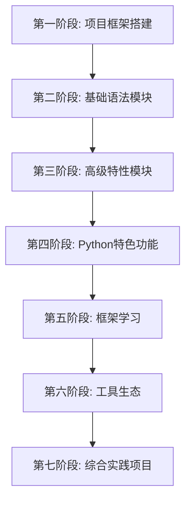

# Python学习路线 - Java开发者版

## 学习目标

通过系统化学习，帮助资深Java开发工程师在8-10周内掌握Python语言核心技能，并能够：

1. 熟练使用Python进行日常开发
2. 理解Python与Java的核心差异
3. 掌握Python主流框架的使用
4. 具备Python项目的架构设计能力

## 学习路线总览



---

## 第一阶段：项目框架搭建 (1周)

### 学习目标
- 建立完整的学习项目结构
- 理解Python开发环境配置
- 熟悉Python生态系统概览

### 学习内容

#### 1.1 项目初始化
- [x] 创建项目总体设计文档
- [x] 设计目录结构和文件组织
- [x] 搭建学习进度跟踪系统

#### 1.2 环境配置
- [ ] Python解释器安装与配置
- [ ] 虚拟环境创建与管理
- [ ] IDE配置（推荐PyCharm或VSCode）
- [ ] 包管理工具介绍

#### 1.3 Python生态概览
- [ ] Python版本演进历史
- [ ] 核心库与第三方库生态
- [ ] Python在不同领域的应用

### 对比学习重点
- Python vs Java 开发环境差异
- pip vs Maven/Gradle 包管理对比
- Python项目结构 vs Java项目结构

---

## 第二阶段：基础语法模块 (1-2周)

### 学习目标
- 掌握Python基础语法
- 理解Python数据类型系统
- 熟悉Python代码风格和最佳实践

### 2.1 变量和数据类型 (2天)

#### 学习内容
- [ ] 基本数据类型：int, float, str, bool
- [ ] 变量声明和命名规范
- [ ] 类型检查和类型提示
- [ ] 常量定义和使用

#### Java对比重点
```python
# Python - 动态类型
name = "Python"        # 自动推导类型
age = 25               # 自动推导类型

# Java - 静态类型
String name = "Java";   // 显式声明类型
int age = 25;          // 显式声明类型
```

#### 实践项目
- 类型转换工具程序
- 变量作用域测试程序

### 2.2 控制流程 (2天)

#### 学习内容
- [ ] 条件判断：if/elif/else
- [ ] 循环结构：for/while
- [ ] 控制语句：break/continue/pass
- [ ] 三元运算符和短路求值

#### Java对比重点
```python
# Python - 简洁的语法
if score >= 90:
    print("优秀")
elif score >= 80:
    print("良好")
else:
    print("及格")

# Java - 更冗长的语法
if (score >= 90) {
    System.out.println("优秀");
} else if (score >= 80) {
    System.out.println("良好");
} else {
    System.out.println("及格");
}
```

#### 实践项目
- 计算器程序
- 猜数字游戏

### 2.3 函数定义 (2天)

#### 学习内容
- [ ] 函数定义和调用
- [ ] 参数传递：位置参数、关键字参数、默认参数
- [ ] 可变参数：*args, **kwargs
- [ ] 函数返回值和多值返回
- [ ] 函数作为第一类对象

#### Java对比重点
```python
# Python - 灵活的参数处理
def greet(name, age=18, *hobbies, **info):
    print(f"Hello {name}, age {age}")
    print(f"Hobbies: {hobbies}")
    print(f"Info: {info}")

greet("Alice", 25, "reading", "coding", city="Beijing")

# Java - 相对固定的方法签名
public static void greet(String name, int age) {
    System.out.println("Hello " + name + ", age " + age);
}
```

#### 实践项目
- 数学工具函数库
- 字符串处理工具集

### 2.4 集合类型 (3天)

#### 学习内容
- [ ] 列表(List)：创建、访问、修改、方法
- [ ] 元组(Tuple)：不可变序列的使用
- [ ] 字典(Dict)：键值对数据结构
- [ ] 集合(Set)：去重和集合运算
- [ ] 集合推导式入门

#### Java对比重点
```python
# Python - 内置集合类型
numbers = [1, 2, 3, 4, 5]           # List vs ArrayList
person = {"name": "Alice", "age": 25}  # Dict vs HashMap
coordinates = (10, 20)              # Tuple vs 不可变对象
unique_nums = {1, 2, 3, 4, 5}      # Set vs HashSet
```

#### 实践项目
- 学生成绩管理系统
- 词频统计程序

### 2.5 字符串处理 (2天)

#### 学习内容
- [ ] 字符串创建和基本操作
- [ ] 字符串格式化：%、.format()、f-string
- [ ] 字符串方法：split、join、replace等
- [ ] 正则表达式基础
- [ ] 编码和解码

#### Java对比重点
```python
# Python - 简洁的字符串操作
name = "Alice"
age = 25
# f-string (Python 3.6+)
message = f"Hello {name}, you are {age} years old"

# Java - StringBuilder或String.format
String name = "Alice";
int age = 25;
String message = String.format("Hello %s, you are %d years old", name, age);
```

#### 实践项目
- 文本分析工具
- 日志解析器

---

## 第三阶段：高级特性模块 (2-3周)

### 学习目标
- 掌握Python面向对象编程
- 理解Python模块和包系统
- 熟练使用异常处理和文件操作

### 3.1 面向对象编程 (5天)

#### 学习内容
- [ ] 类和对象的定义
- [ ] 构造函数和析构函数
- [ ] 实例变量和类变量
- [ ] 实例方法、类方法、静态方法
- [ ] 继承和多重继承
- [ ] 方法重写和super()调用
- [ ] 封装：私有属性和方法
- [ ] 多态性实现
- [ ] 特殊方法（魔术方法）

#### Java对比重点
```python
# Python - 更加灵活的类定义
class Animal:
    species_count = 0  # 类变量
    
    def __init__(self, name, age):  # 构造函数
        self.name = name      # 实例变量
        self.age = age
        Animal.species_count += 1
    
    def speak(self):          # 实例方法
        pass
    
    @classmethod
    def get_species_count(cls):  # 类方法
        return cls.species_count
    
    @staticmethod
    def is_adult(age):       # 静态方法
        return age >= 18

# Java - 更严格的类定义
public class Animal {
    private static int speciesCount = 0;  // 类变量
    private String name;                   // 实例变量
    private int age;
    
    public Animal(String name, int age) {  // 构造函数
        this.name = name;
        this.age = age;
        speciesCount++;
    }
    
    public void speak() {                  // 实例方法
        // 实现
    }
    
    public static int getSpeciesCount() {  // 静态方法
        return speciesCount;
    }
}
```

#### 实践项目
- 图形几何类层次结构
- 员工管理系统
- 简单的ORM框架

### 3.2 错误处理 (3天)

#### 学习内容
- [ ] 异常处理机制：try/except/else/finally
- [ ] 异常类型和继承关系
- [ ] 自定义异常类
- [ ] 异常链和异常信息
- [ ] 断言和调试技巧
- [ ] 日志记录最佳实践

#### Java对比重点
```python
# Python - 简洁的异常处理
try:
    result = 10 / 0
except ZeroDivisionError as e:
    print(f"除零错误: {e}")
except Exception as e:
    print(f"其他错误: {e}")
else:
    print("没有异常")
finally:
    print("清理资源")

# Java - 更详细的异常声明
try {
    int result = 10 / 0;
} catch (ArithmeticException e) {
    System.out.println("算术错误: " + e.getMessage());
} catch (Exception e) {
    System.out.println("其他错误: " + e.getMessage());
} finally {
    System.out.println("清理资源");
}
```

#### 实践项目
- 健壮的文件处理工具
- 网络请求重试机制
- 自定义异常体系设计

### 3.3 文件I/O操作 (2天)

#### 学习内容
- [ ] 文件的打开、读取、写入
- [ ] 文件路径处理：os.path和pathlib
- [ ] 文本文件和二进制文件处理
- [ ] CSV、JSON、XML文件处理
- [ ] 文件压缩和解压
- [ ] 目录操作和文件系统遍历

#### Java对比重点
```python
# Python - 简洁的文件操作
# 自动资源管理
with open('data.txt', 'r', encoding='utf-8') as f:
    content = f.read()

# 路径处理
from pathlib import Path
file_path = Path('data') / 'file.txt'

# Java - 更复杂的资源管理
try (BufferedReader reader = Files.newBufferedReader(
        Paths.get("data.txt"), StandardCharsets.UTF_8)) {
    String content = reader.lines()
        .collect(Collectors.joining("\n"));
} catch (IOException e) {
    e.printStackTrace();
}
```

#### 实践项目
- 配置文件管理器
- 批量文件处理工具
- 简单的数据备份系统

### 3.4 模块和包管理 (2天)

#### 学习内容
- [ ] 模块的创建和导入
- [ ] 包的结构和__init__.py
- [ ] 相对导入和绝对导入
- [ ] 模块搜索路径
- [ ] 标准库常用模块
- [ ] 第三方包的安装和使用

#### Java对比重点
```python
# Python - 简单的模块导入
import math
from datetime import datetime
from mypackage.mymodule import MyClass

# 动态导入
module_name = "math"
math_module = __import__(module_name)

# Java - 包声明和导入
package com.example.myapp;
import java.util.Date;
import java.math.BigDecimal;
import com.example.utils.MyUtility;
```

#### 实践项目
- 自定义工具包开发
- 插件系统设计
- 配置管理模块

---

## 第四阶段：Python特色功能 (1-2周)

### 学习目标
- 掌握Python独有的语言特性
- 理解函数式编程概念
- 熟练使用Python高级特性

### 4.1 推导式 (2天)

#### 学习内容
- [ ] 列表推导式
- [ ] 字典推导式
- [ ] 集合推导式
- [ ] 生成器表达式
- [ ] 嵌套推导式
- [ ] 推导式的性能优化

#### Java对比重点
```python
# Python - 简洁的推导式
# 列表推导式
squares = [x**2 for x in range(10) if x % 2 == 0]

# 字典推导式
square_dict = {x: x**2 for x in range(5)}

# Java - 使用Stream API
// Java 8+ Stream
List<Integer> squares = IntStream.range(0, 10)
    .filter(x -> x % 2 == 0)
    .map(x -> x * x)
    .boxed()
    .collect(Collectors.toList());
```

#### 实践项目
- 数据转换工具
- 文本处理器
- 统计分析脚本

### 4.2 高级函数特性 (3天)

#### 学习内容
- [ ] Lambda函数和匿名函数
- [ ] 高阶函数：map、filter、reduce
- [ ] 装饰器：函数装饰器、类装饰器
- [ ] 闭包和作用域
- [ ] 生成器和yield
- [ ] 协程和async/await

#### Java对比重点
```python
# Python - 装饰器模式
def timer(func):
    def wrapper(*args, **kwargs):
        start = time.time()
        result = func(*args, **kwargs)
        end = time.time()
        print(f"{func.__name__} took {end - start:.2f} seconds")
        return result
    return wrapper

@timer
def slow_function():
    time.sleep(1)

# Java - 需要更复杂的实现
// 代理模式或AOP框架
@Timed  // 需要框架支持
public void slowMethod() {
    // 方法实现
}
```

#### 实践项目
- 性能监控装饰器
- 缓存系统实现
- 异步任务处理器

### 4.3 并发处理 (3天)

#### 学习内容
- [ ] 多线程编程：threading模块
- [ ] 多进程编程：multiprocessing模块
- [ ] 异步编程：asyncio模块
- [ ] 协程和事件循环
- [ ] 线程安全和锁机制
- [ ] 进程间通信

#### Java对比重点
```python
# Python - 简洁的并发编程
import threading
import asyncio

# 多线程
def worker(name):
    print(f"Worker {name} is running")

threads = []
for i in range(5):
    t = threading.Thread(target=worker, args=(i,))
    threads.append(t)
    t.start()

# 异步编程
async def async_task(name):
    await asyncio.sleep(1)
    print(f"Task {name} completed")

async def main():
    tasks = [async_task(i) for i in range(5)]
    await asyncio.gather(*tasks)

# Java - 更复杂的并发控制
ExecutorService executor = Executors.newFixedThreadPool(5);
for (int i = 0; i < 5; i++) {
    final int taskId = i;
    executor.submit(() -> {
        System.out.println("Worker " + taskId + " is running");
    });
}
executor.shutdown();
```

#### 实践项目
- 网络爬虫系统
- 并发文件处理器
- 实时数据处理管道

---

## 第五阶段：框架学习 (3-4周)

### 学习目标
- 掌握主流Python Web框架
- 理解ORM和数据库操作
- 学会API设计和开发

### 5.1 Web框架对比 (2周)

#### Django vs Spring Boot (5天)
- [ ] Django项目结构和MVT模式
- [ ] Django ORM和数据库迁移
- [ ] Django Admin和用户认证
- [ ] Django REST Framework
- [ ] 对比Spring Boot的特性

#### FastAPI vs Spring Boot (3天)
- [ ] FastAPI项目结构
- [ ] 自动API文档生成
- [ ] 依赖注入系统
- [ ] 异步请求处理
- [ ] 对比Spring Boot的性能

#### Flask vs Spring MVC (2天)
- [ ] Flask轻量级框架特点
- [ ] 蓝图和应用工厂模式
- [ ] Flask扩展生态
- [ ] 对比Spring MVC的灵活性

### 5.2 数据库操作 (1周)

#### SQLAlchemy vs MyBatis (4天)
- [ ] SQLAlchemy ORM核心概念
- [ ] 模型定义和关系映射
- [ ] 查询构建器和原生SQL
- [ ] 数据库连接池和会话管理
- [ ] 对比MyBatis的XML配置

#### 数据库最佳实践 (3天)
- [ ] 数据库迁移策略
- [ ] 查询优化技巧
- [ ] 事务处理和并发控制
- [ ] 数据备份和恢复

### 5.3 测试框架 (1周)

#### Pytest vs JUnit (4天)
- [ ] 测试用例编写和组织
- [ ] 参数化测试和数据驱动
- [ ] 测试夹具和依赖注入
- [ ] 模拟和存根技术
- [ ] 对比JUnit的注解系统

#### 测试策略 (3天)
- [ ] 单元测试最佳实践
- [ ] 集成测试设计
- [ ] 测试覆盖率分析
- [ ] 持续集成和测试自动化

---

## 第六阶段：工具生态 (1-2周)

### 学习目标
- 掌握Python包管理工具
- 熟悉开发环境配置
- 学会项目部署和运维

### 6.1 包管理工具 (3天)

#### pip vs Maven (1天)
- [ ] pip基本命令和配置
- [ ] requirements.txt管理
- [ ] 私有包索引配置
- [ ] 对比Maven的依赖管理

#### poetry vs Gradle (2天)
- [ ] poetry项目初始化
- [ ] pyproject.toml配置
- [ ] 依赖版本锁定
- [ ] 对比Gradle的构建系统

### 6.2 开发环境 (4天)

#### 虚拟环境管理 (2天)
- [ ] venv和virtualenv使用
- [ ] conda环境管理
- [ ] pyenv版本管理
- [ ] Docker开发环境

#### IDE配置和调试 (2天)
- [ ] PyCharm/VSCode配置
- [ ] 代码格式化和linting
- [ ] 调试技巧和性能分析
- [ ] 代码质量工具

### 6.3 部署工具 (3天)

#### 应用部署 (2天)
- [ ] Docker容器化
- [ ] uWSGI/Gunicorn配置
- [ ] 负载均衡和反向代理
- [ ] 云平台部署

#### 监控和运维 (1天)
- [ ] 日志管理和分析
- [ ] 性能监控工具
- [ ] 错误追踪系统
- [ ] 健康检查和报警

---

## 第七阶段：综合实践项目 (2-3周)

### 学习目标
- 通过实际项目巩固所学知识
- 体验完整的开发流程
- 积累项目经验和最佳实践

### 7.1 Web API项目 (1周)

#### 项目需求
开发一个用户管理系统的RESTful API

#### 技术栈
- FastAPI + SQLAlchemy + PostgreSQL
- Redis缓存 + Celery异步任务
- JWT认证 + 权限控制
- Docker部署 + API文档

#### 学习成果
- [ ] 项目架构设计
- [ ] API接口开发
- [ ] 数据库设计和优化
- [ ] 缓存策略实现
- [ ] 异步任务处理
- [ ] 安全认证机制
- [ ] 部署和运维

### 7.2 数据分析项目 (5天)

#### 项目需求
构建一个数据分析和可视化平台

#### 技术栈
- Pandas + NumPy + Matplotlib
- Jupyter Notebook + Streamlit
- SQLite/PostgreSQL数据存储
- 定时任务和报告生成

#### 学习成果
- [ ] 数据清洗和预处理
- [ ] 统计分析和建模
- [ ] 数据可视化设计
- [ ] 交互式报告生成
- [ ] 自动化数据流水线

### 7.3 微服务项目 (5天)

#### 项目需求
设计一个简单的电商微服务系统

#### 技术栈
- Flask/FastAPI多服务
- 服务注册和发现
- API网关和负载均衡
- 消息队列通信
- 分布式配置管理

#### 学习成果
- [ ] 微服务架构设计
- [ ] 服务间通信机制
- [ ] 配置中心实现
- [ ] 服务监控和治理
- [ ] 分布式部署策略

---

## 学习评估和认证

### 阶段性评估
每个阶段结束后进行技能评估：
- [ ] 理论知识测试
- [ ] 编程实践考核
- [ ] 项目代码Review
- [ ] Java对比总结报告

### 最终项目
选择一个综合性项目作为毕业设计：
- [ ] 需求分析和架构设计
- [ ] 完整的开发实现
- [ ] 测试和部署文档
- [ ] 技术总结和分享

### 持续学习计划
- [ ] Python生态系统跟踪
- [ ] 新特性学习和实践
- [ ] 开源项目贡献
- [ ] 技术社区参与

---

## 学习资源推荐

### 官方文档
- [Python官方文档](https://docs.python.org/3/)
- [Django文档](https://docs.djangoproject.com/)
- [FastAPI文档](https://fastapi.tiangolo.com/)

### 在线教程
- [Real Python](https://realpython.com/)
- [Python.org教程](https://docs.python.org/3/tutorial/)
- [廖雪峰Python教程](https://www.liaoxuefeng.com/wiki/1016959663602400)

### 实践平台
- [LeetCode Python](https://leetcode.com/)
- [HackerRank Python](https://www.hackerrank.com/domains/python)
- [Kaggle学习](https://www.kaggle.com/learn)

### 开源项目
- [Django源码](https://github.com/django/django)
- [Flask源码](https://github.com/pallets/flask)
- [Requests源码](https://github.com/psf/requests)

---

## 学习建议

### 学习方法
1. **对比学习**：始终与Java概念对比理解
2. **实践驱动**：每个概念都要有代码实践
3. **项目导向**：通过项目巩固知识点
4. **社区参与**：积极参与Python社区讨论

### 时间安排
- **每日学习时间**：2-3小时
- **周末实践时间**：4-6小时
- **总学习周期**：8-10周
- **项目实践比例**：40%

### 学习重点
1. **语法差异**：重点关注与Java的不同
2. **设计哲学**：理解Python的设计思想
3. **生态系统**：熟悉Python工具链
4. **最佳实践**：学习Pythonic编程风格

### 常见陷阱
1. **性能思维**：不要完全按Java的性能模式思考
2. **类型系统**：适应动态类型的灵活性
3. **内存管理**：理解Python的内存管理机制
4. **编程范式**：拥抱Python的多范式特性

---

**最后更新时间**: 2024年1月  
**预计完成时间**: 2024年3月  
**学习进度**: 第一阶段进行中 