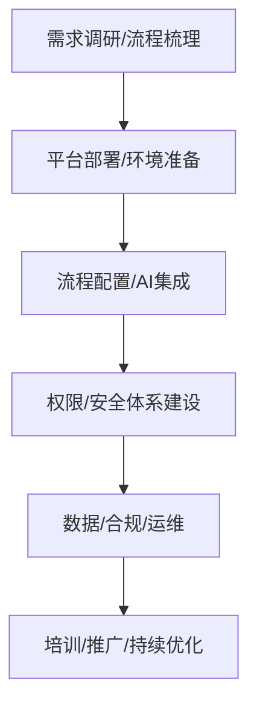

# 智能审批流平台企业落地方案

---

## 一、典型企业应用场景

- 费用报销、采购、合同、用印等多级审批自动化
- 智能客服、工单流转、业务流程自动分发
- 风险评估、合规审查、AI辅助决策
- 多业务线/多子公司/多租户统一审批平台

---

## 二、企业落地实施步骤

### 1. 需求调研与流程梳理
- 梳理企业现有审批/业务流，明确节点、分支、规则、审批人
- 明确多租户/多业务线隔离需求
- 识别AI可赋能环节（如风险评估、智能分流、自动建议）

### 2. 平台部署与环境准备
- 推荐Docker/K8s部署，支持多环境（开发/测试/生产）
- 配置数据库、对象存储、日志、监控等基础设施
- 配置企业专属大模型API Key（如DeepSeek、OpenAI）

### 3. 流程配置与AI集成
- 通过Web可视化设计器配置审批流（支持拖拽、属性编辑、DSL导入导出）
- 配置AI风险评估节点、分支条件、审批人等
- 支持多租户/多业务线独立配置与切换

### 4. 权限与安全体系建设
- 集成企业统一认证（如LDAP、OAuth2、SSO）
- 配置细粒度角色权限（管理员、审批人、只读、运维等）
- API安全加固，敏感操作审计与告警

### 5. 数据与合规
- 审批流配置、审批历史、AI评估结果等数据分级存储
- 关键操作留痕，支持合规审计与追溯
- 支持数据定期备份、加密、脱敏

### 6. 运维与升级
- 接入企业监控平台（Prometheus、ELK等），关键指标可视化
- 支持CI/CD自动化部署，灰度发布与回滚
- 支持审批流配置变更历史、对比与回滚
- 支持流程图美化、导出归档

### 7. 培训与推广
- 组织业务/IT培训，编写操作手册与FAQ
- 设立流程管理员/超级用户，推动业务线自主配置
- 持续收集反馈，迭代优化平台能力

---

## 三、组织协作与治理建议

- 设立流程/平台管理员，负责配置、权限、变更管理
- 业务线自主维护本业务流程，IT团队提供平台支持
- 关键变更需审批/评审，保障流程合规与安全
- 建立变更、运维、监控、告警、应急响应机制

---

## 四、常见问题与最佳实践

### 1. 如何保障多租户/多业务线隔离？
- 流程、数据、权限、日志、监控等全链路隔离
- API、前端、存储均按租户/业务线分层

### 2. 如何应对AI模型能力变化？
- 支持多模型切换、参数灵活配置
- 关键节点可AI+规则混合决策，保障稳定性

### 3. 如何保障审批流配置安全？
- 变更留痕、历史可回滚、操作需鉴权
- 关键操作审计与告警

### 4. 如何对接企业现有系统？
- 提供标准API，支持与ERP、OA、HR等系统集成
- 支持Webhook、消息推送、外部API调用

### 5. 如何持续优化平台能力？
- 持续收集用户反馈，定期评审与迭代
- 关注AI合规、数据安全、业务创新

---

## 五、推荐落地流程图

---

如需定制化企业落地方案、PPT模板、操作手册或对接指导，请联系平台技术支持团队。 